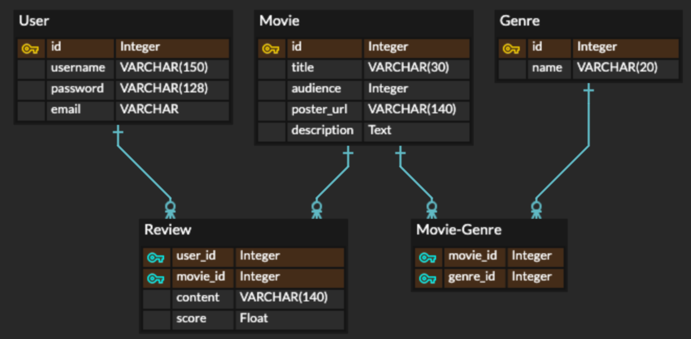

-----


# 프로젝트 선택사항

### 개발 아티텍처

- Django REST API 서버(djangorestframework) + VueJS (Node, SFC)

### 필수 기능

i. 관리자 권한의 유저만 영화 등록 및 수정 / 삭제 권한을 가집니다.
(별도의 관리자 권한의 뷰가 구성되어야 합니다.)

ii. 관리자 권한의 유저는 유저 관리 (수정 / 삭제 권한)을 가집니다.
(별도의 관리자 권한의 뷰가 구성되어야 합니다.)

iii. 관리자 페이지를 제외하고 최소한 5개 이상의 URL 및 페이지 구성을 하여야 합니다.

iv. 모든 로그인 된 유저는 영화에 대한 평점을 등록 / 수정 / 삭제 등을 할 수 있어야 합니다.

v. 평점을 등록한 유저는 해당 정보를 기반으로 영화를 추천 받을 수 있어야 합니다.

vi. 데이터베이스에 기록되는 모든 정보는 유효성 검사를 진행해야 하며, 필요에 따라 해당하는
정보를 클라이언트 화면에 띄워줄 수 있어야 합니다.

vii. HTTP method와 상태 코드는 적절하게 반환되어야 하며, 필요에 따라 해당하는 에러
페이지도 구성을 할 수 있습니다.

viii. 사용자가 활용하기 편하도록 설계된 마크업 및 스타일 구성을 하여야 합니다.

ix. 필요한 경우 Ajax를 활용한 비동기적 처리를 하여 사용자 경험을 향상시켜야 합니다.

x. 이외 추가적인 기능은 자유롭게 구성 가능 합니다.

### 추가기능

- 모바일 대응을 한 반응형 웹,
- 소스 관리는 pull&request 방식
- 커뮤니티 서비스 - 리뷰(댓글형식으로)
- 영화 관련 정보 아카이빙 서비스 - 유저 상세페이지

### 우선구현

영화 R(index, detail)

영화 리뷰 CU(구현해야됨)D R은 영화 detail(컴포넌트)

유저 상세 정보

---

제출형식

A. 완성된 소스코드의 Gitlab 주소를 담임 교수에게 제출한다.
B. 해당 저장소에는 반드시 README.md을 통해 아래의 내용이 기록되어야 한다.
i. 팀원 정보 및 업무 분담 내역
ii. 목표 서비스 구현 및 실제 구현 정도 (가능하다면 일자별 업무 진행 정도 포함)
iii. 데이터베이스 모델링(ERD)
iv. 핵심 기능
v. 배포 서버 URL
vi. 기타 (느낀점)
C. 추후 담당 교수의 안내에 따라 추가적인 자료 제출이 요구될 수 있다

---

### Request(q) - Response(s)

- Login.vue
  - q: 회원 가입
  - q: 로그인
- MyPage.vue
  - q: 유저 정보
    - s: 유저 아이디, 이메일
    - s: 유저가 좋아한 영화 목록
    - s: 유저가 작성한 리뷰
- Movies.vue
  - q: 영화 추천
    - s: 영화 목록
  - q: 전체 영화 목록
    - s: 전체 영화 목록
- Movie.vue
  - q: 영화 정보
    - s: 영화명, 관객수, 포스터url, 줄거리, 장르목록
  - q: 영화의 리뷰
    - s: (평점, 내용)의 영화 리뷰들
  - q: 리뷰 생성
- AdminMovie.vue
  - q: 영화 생성, 수정, 삭제
- AdminUser.vue
  - q: 유저 리스트
    - s: (유저PK, 유저아이디) 목록
  - q: 유저 정보
    - s: 유저 아이디, 이메일
    - s: 유저가 좋아한 영화 목록
    - s: 유저가 작성한 리뷰

---



---

### Signup

[django-rest-auth](https://django-rest-auth.readthedocs.io/en/latest/installation.html)

App 인스톨

```bash
$ pip install django-rest-auth
$ pip install django-allauth
```

App 사용 설정 및 환경 설정

```python
# settings.py
INSTALLED_APPS = (
    ...,
    'rest_framework',
    'rest_framework.authtoken',
    'rest_auth'
    'django.contrib.sites',
    'allauth',
    'allauth.account',
    'rest_auth.registration',
    ...,
)

SITE_ID = 1
# REST_USE_JWT를 설정하지 하면, 가입 신청의 response로 JWT를 돌려받음
REST_USE_JWT=True
```

아래의 주석된 두 줄의 코드를 삭제하여, django의 key가 아닌 JWT를 반환하도록 설정

```python
# settings.py
REST_FRAMEWORK = {
    'DEFAULT_PERMISSION_CLASSES': (
        'rest_framework.permissions.IsAuthenticated',

    ),
    'DEFAULT_AUTHENTICATION_CLASSES': (
        'rest_framework_jwt.authentication.JSONWebTokenAuthentication',
        # 'rest_framework.authentication.SessionAuthentication',
        # 'rest_framework.authentication.BasicAuthentication',
    ),
}
```

사용할 URL 설정

```python
# pjt_name/urls.py
urlpatterns = [
    ...,
    path('rest-auth/', include('rest_auth.urls')),
    path('rest-auth/registration/', include('rest_auth.registration.urls')),
]
```

```bash
$ django manage.py migrate
```


